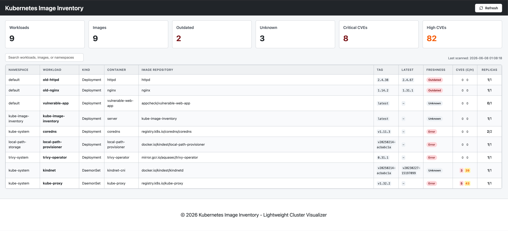

# Kubernetes Image Inventory

Kubernetes Image Inventory is a small read-only web UI that lists container images currently running in a Kubernetes cluster.



> [!IMPORTANT]
> **Disclaimer:** This is a **pet project** and a **minimum viable product (MVP)**. 
> This software is provided "as is", without warranty of any kind. Use at your own risk.

## Current Functionality

- **Cluster Inventory**: Lists all workloads (Deployments, StatefulSets, DaemonSets, etc.) and their container images.
- **Image Freshness**: Checks if a newer tag is available in the registry (supports Docker Hub, GHCR, etc.).
- **Vulnerability Scanning**: Displays CVE counts if Trivy Operator is present in the cluster.
- **Read-Only**: Requires only read permissions for Kubernetes resources.

## Requirements

- Python 3.11+
- Access to a Kubernetes cluster (local or remote)
- Docker (optional, for containerized execution)

## Local Execution

1. Clone the repository.
2. Install dependencies:
   ```bash
   make install
   ```
3. Run the application:
   ```bash
   make run
   ```
   *Note: This will use your local `~/.kube/config` by default.*

## Docker Execution

1. Build the image:
   ```bash
   make build
   ```
2. Run the container:
   ```bash
   docker run --rm -p 8000:8000 \
     -v ~/.kube:/home/appuser/.kube:ro \
     -e KUBE_IMAGE_INVENTORY_DEV_KUBECONFIG=true \
     kube-image-inventory
   ```

## Kubernetes Deployment

Deploy using Kustomize:

```bash
make deploy
```

This will create:
- A dedicated `kube-image-inventory` namespace.
- A ServiceAccount with read-only RBAC permissions.
- A Deployment and Service.

Access the UI using port-forwarding:

```bash
make port-forward
```

## Configuration

| Environment Variable | Default | Description |
|----------------------|---------|-------------|
| `DATABASE_URL` | `sqlite:///./inventory.db` | SQLite database location. |
| `KUBE_IMAGE_INVENTORY_DEV_KUBECONFIG` | `false` | Enable local kubeconfig when running outside the cluster. |
| `SCAN_INTERVAL_SECONDS` | `900` | Background scan interval in seconds. |

## Kubernetes RBAC

The application requires `get`, `list`, and `watch` permissions for:
- `pods`, `namespaces`, `nodes`
- `deployments`, `statefulsets`, `daemonsets`, `replicasets` (apps)
- `jobs`, `cronjobs` (batch)
- `vulnerabilityreports` (aquasecurity.github.io, optional)

## Security Limitations

> [!WARNING]
> The application does not provide built-in authentication.
> Do not expose it publicly without external access control (e.g., VPN, IAP, or Reverse Proxy with Auth).

## Known Limitations

- **Registry Rate Limits**: Heavy scanning may trigger rate limits on public registries (e.g., Docker Hub).
- **In-Memory Cache**: Restarts will trigger a fresh scan of the cluster and registries.
- **Trivy Integration**: Relies on Trivy Operator being installed in the cluster for CVE data.

